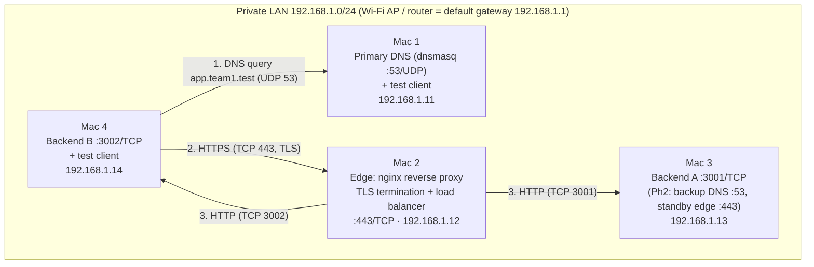
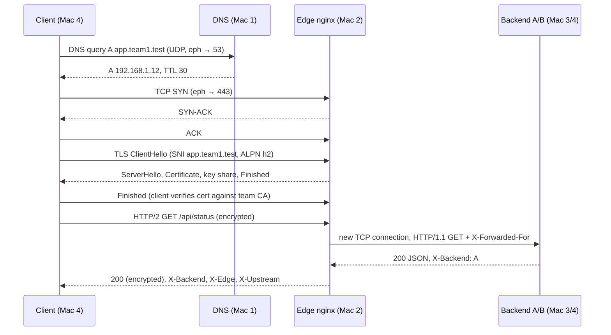

# Architecture Document — Team ____ (team1.test)

Members: ____________ · ____________ · ____________ · ____________

## 1. Network topology

All four Macs are hosts on one private IPv4 subnet behind one Wi-Fi access point / router (a single broadcast domain — a star topology at the physical level). Every role is a *network role*, not a software tier.

## 2. IP and service inventory

| Machine | Hostname | Interface | IPv4 / prefix | Gateway | MAC address | Services (port/proto) | Cloud equivalent |
|---|---|---|---|---|---|---|---|
| Mac 1 | | en0 | 192.168.1.11/24 | 192.168.1.1 | | dnsmasq 53/UDP+TCP | Route 53 (private hosted zone) |
| Mac 2 | | en0 | 192.168.1.12/24 | 192.168.1.1 | | nginx 443/TCP, 80/TCP | AWS ALB / GCP LB / CDN edge |
| Mac 3 | | en0 | 192.168.1.13/24 | 192.168.1.1 | | Backend A 3001/TCP; Ph2: dnsmasq 53, nginx 443 | EC2 instance in target group; secondary DNS |
| Mac 4 | | en0 | 192.168.1.14/24 | 192.168.1.1 | | Backend B 3002/TCP | EC2 instance in target group |

DNS records (TTL 30 s): `app.team1.test A 192.168.1.12`, `api.team1.test A 192.168.1.12`, helper names `dns1`, `dns2`, `edge`, `backend-a`, `backend-b`.

Backend ports 3001/3002 are reachable **only from the edge** in Phase 2 (pf rules) — the equivalent of a security group that only allows the load balancer.

## 3. Request flow (one `curl https://app.team1.test/api/status`)

## 4. Protocol-to-layer map

| Protocol in this project | OSI layer | TCP/IP layer | Where it appears |
|---|---|---|---|
| HTTP/1.1, HTTP/2 (REST, Cache-Control, ETag) | 7 Application | Application | client ↔ nginx (inside TLS), nginx ↔ backend (plain) |
| DNS | 7 Application | Application | client ↔ dnsmasq |
| TLS 1.2 / 1.3 | 5–6 Session/Presentation (sits on TCP) | between Application and Transport | client ↔ nginx only (terminated at edge) |
| TCP (443, 3001, 3002), UDP (53) | 4 Transport | Transport | every hop; ports identify the service |
| IPv4 (192.168.1.0/24), ICMP (ping) | 3 Network | Internet | addressing between Macs |
| Wi-Fi 802.11 / Ethernet frames, ARP, MAC addresses | 2 Data link | Link | each Mac ↔ access point |
| Radio | 1 Physical | Link | Wi-Fi |

## 5. Phase 2 changes (update before Review 2)

| Change | Machine | Effect |
|---|---|---|
| Backup dnsmasq with identical records | Mac 3 | clients list Mac 1, Mac 3; DNS survives Mac 1 failure |
| Short TTL (30 s) | DNS | fast, observable record changes |
| pf anchor: 3001/3002 only from Mac 2 | Mac 3, Mac 4 | backends unreachable except via edge |
| Passive health checks + retry | Mac 2 | backend failure invisible to clients |
| Standby nginx, same cert | Mac 3 | DNS cutover target; edge no longer irreplaceable |

Remaining single points of failure: the active edge at any moment (until a floating VIP / VRRP is added), and the Wi-Fi access point itself.
