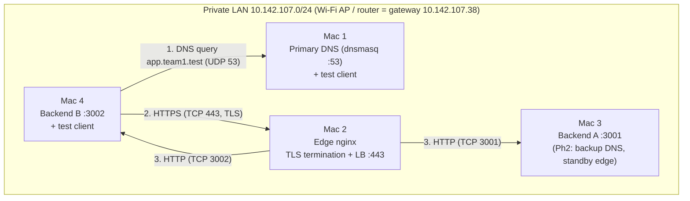
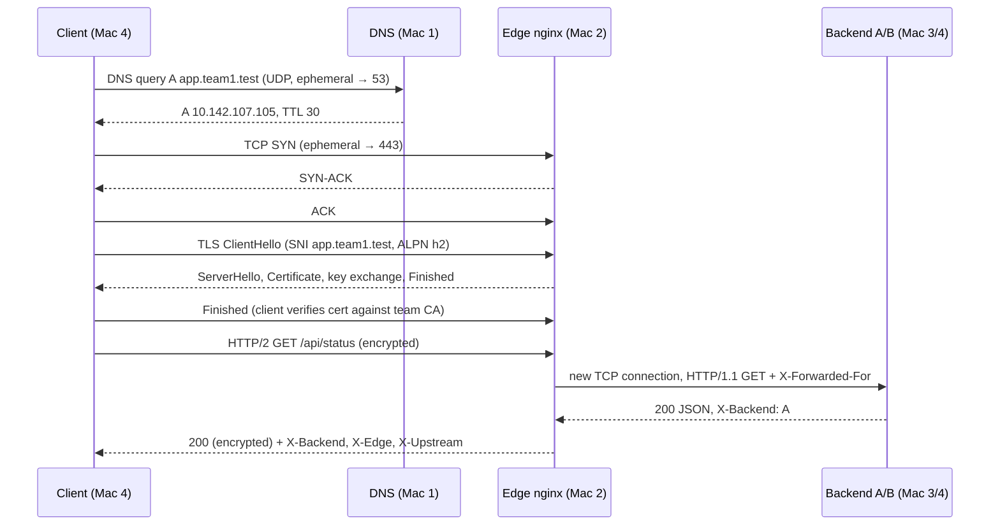

# Private Network Service Platform — Project Report

**Course:** Computer Networks — Course Project (two-phase, team-based local networking project)
**Team:** team1 · private domain `team1.test`
**Members:** keshav - rohit - sarvesh 
**Environment:** 4 × macOS laptops on one private Wi-Fi LAN, fully local, no cloud

> **Core principle:** the application stays simple. The network is the project.

---

## Table of Contents

1. [Project Purpose & Overview](#1-project-purpose--overview)
2. [Learning Objectives](#2-learning-objectives)
3. [Constraints & Design Decisions](#3-constraints--design-decisions)
4. [Network Architecture](#4-network-architecture)
5. [Repository / Configuration Bundle](#5-repository--configuration-bundle)
6. [Phase 1: Build & Observe](#6-phase-1--build--observe)
7. [Phase 1: Failure Demonstrations](#7-phase-1--failure-demonstrations)
8. [Phase 2: Harden, Recover & Troubleshoot](#8-phase-2--harden-recover--troubleshoot)
9. [What Changed from Phase 1 to Phase 2](#9-what-changed-from-phase-1-to-phase-2)
10. [Resilience Tests & Results](#10-resilience-tests--results)
11. [Troubleshooting Findings](#11-troubleshooting-findings)
12. [Final Demonstration Sequence](#12-final-demonstration-sequence)
13. [Deliverables Checklist](#13-deliverables-checklist)
14. [Learning Summary](#14-learning-summary)
15. [Limitations & Future Work](#15-limitations--future-work)
16. [Marks Mapping](#16-marks-mapping)

---

## 1. Project Purpose & Overview

The goal was to build a small private service environment from scratch on our own laptops, then observe how one request travels from a client to a server and back.

When the project is finished, a client Mac on the team LAN can:

1. type `https://app.team1.test` into a browser or `curl`,
2. resolve that name through **our own DNS server** (dnsmasq on Mac 1),
3. open a **secure HTTPS connection** to our **reverse proxy / load balancer** (nginx on Mac 2),
4. get a response from **one of two backend servers** (Mac 3 = A, Mac 4 = B),
5. let us **observe every step** (DNS → TCP → TLS → HTTP) with `dig`, `curl -v`, `tcpdump`, and Wireshark.

| Phase | Theme | Topics |
|---|---|---|
| Phase 1 | Build & Observe | DNS · HTTP(S) · TCP · TLS · Load Balancing · Packet Analysis |
| Phase 2 | Harden & Recover | Backup DNS · TTL · Service Isolation · HA Failover · DNS Cutover · Troubleshooting |
| Final | Explain & Defend | Live demo · Packet evidence · Individual viva |

---

## 2. Learning Objectives

| Objective | How the project meets it |
|---|---|
| Turn classroom theory into a working configuration | We configured and ran DNS (dnsmasq), TLS (OpenSSL CA + nginx), TCP services, and a load balancer ourselves. |
| Explain where each protocol fits in a real request | Section 4.4 maps each protocol to its OSI/TCP-IP layer, and Section 4.3 walks through one request end to end. |
| Prove behaviour with tools | Every task has a script that produces evidence: `dig`, `curl -v/-I`, `tcpdump` → Wireshark, nginx access logs. |
| Diagnose failures by isolating layers | `scripts/diagnose.sh` checks DNS → IP → TCP → TLS → HTTP in order and reports the first layer that fails. |
| Every member understands the whole system | Each Mac holds an identical copy of the repo. `docs/viva-prep.md` covers every component. |

---

## 3. Constraints & Design Decisions

| Constraint (from brief) | Our decision |
|---|---|
| ≤ 4 students, ≤ 4 macOS laptops | 4 Macs, one network role each (Section 4.1). |
| Same private Wi-Fi / LAN | All Macs on one hotspot/router. *Private Wi-Fi address = Fixed* so MAC/IP stay stable. |
| No cloud | Everything runs locally. Cloud equivalents are explained, not used. |
| Admin access on DNS + edge | Homebrew installs `dnsmasq` and `nginx`. `sudo` is used for port 53/443, resolver settings, and pf. |
| Simple application | One file, standard-library-only Python REST server (`backend/server.py`). |
| Ports 80/443 may be blocked | Ports are set in `config.env` (`HTTPS_PORT=443`, fallback `8443`). |
| Use `.test`, never `.local` | Domain `team1.test` (`.local` conflicts with macOS mDNS/Bonjour). |
| Suggested tools | Homebrew, dnsmasq, nginx, OpenSSL, Python 3, curl, dig/nslookup, tcpdump, Wireshark. |

**Single source of truth.** All IPs, ports, team name, and TTL live in **one file, `config.env`**. `render.sh` substitutes them into every template (`*.tmpl`) and writes the result to `build/`. If an IP changes, we edit one file, re-render, and re-install. Nothing is hard-coded anywhere else.

---

## 4. Network Architecture

### 4.1 Machine roles

| Machine | Primary role | Services running | Cloud equivalent |
|---|---|---|---|
| **Mac 1** | Primary private DNS + test client | dnsmasq (53/UDP+TCP), dig, nslookup, curl, browser | Amazon Route 53 (private hosted zone) |
| **Mac 2** | Edge: reverse proxy + TLS termination + load balancer | nginx (443/TCP, 80/TCP → 301), TLS certificate | AWS ALB / GCP Load Balancer / CDN edge |
| **Mac 3** | Backend A (Phase 2: backup DNS + standby edge) | Python REST app on 3001/TCP; Ph2: dnsmasq 53, nginx 443 | EC2 instance in a target group, secondary DNS |
| **Mac 4** | Backend B + test client + packet capture | Python REST app on 3002/TCP, curl, Wireshark/tcpdump | EC2 instance in a target group |

### 4.2 IP & service inventory

Values come from the team's `config.env` (MAC4 copy) and `evidence/phase1/A1-netinfo-*.txt`. Fill in the blank cells from each Mac's `scripts/netinfo.sh` output.

| Machine | Interface | IPv4 / prefix | Gateway | MAC address | Services |
|---|---|---|---|---|---|
| Mac 1 | en0 | 10.142.107.114/24 | 10.142.107.38 | ________ | dnsmasq :53 |
| Mac 2 | en0 | 10.142.107.105/24 | 10.142.107.38 | ________ | nginx :443, :80 |
| Mac 3 | en0 | 10.142.107.97/24 | 10.142.107.38 | ________ | Backend A :3001 · Ph2: dnsmasq :53, nginx :443 |
| Mac 4 | en0 | 10.142.107.96/24 | 10.142.107.38 | 9e:28:37:36:f9:34 | Backend B :3002 |

Subnet mask `255.255.255.0` (prefix `/24`) was recorded on Mac 4. All four hosts share one broadcast domain behind a single access point: a star topology at the physical level.

**DNS records** (`dns/team.hosts.tmpl`, TTL 30 s):

| Name | Type | Value |
|---|---|---|
| `app.team1.test` | A | Mac 2 (10.142.107.105) |
| `api.team1.test` | A | Mac 2 (10.142.107.105) |
| `edge.team1.test` | A | Mac 2 |
| `dns1.team1.test` | A | Mac 1 |
| `dns2.team1.test` | A | Mac 3 (backup DNS) |
| `backend-a.team1.test` | A | Mac 3 |
| `backend-b.team1.test` | A | Mac 4 |

### 4.3 Topology & request flow



Simplified flow: **Client (Mac 1 / Mac 4) → DNS query (Mac 1) → HTTPS request (Mac 2 / nginx) → Backend A (Mac 3) or Backend B (Mac 4)**

What happens during one `curl https://app.team1.test/api/status`:



The client only ever learns **Mac 2's IP**. The backends sit behind the edge, which opens a **separate TCP connection** to them. So the client never needs, or sees, backend addresses.

### 4.4 Protocol-to-layer map

| Protocol in this project | OSI layer | TCP/IP layer | Where it appears |
|---|---|---|---|
| HTTP/1.1, HTTP/2 (REST, Cache-Control, ETag) | 7 Application | Application | client ↔ nginx (inside TLS), nginx ↔ backend (plain HTTP/1.1) |
| DNS | 7 Application | Application | client ↔ dnsmasq |
| TLS 1.2 / 1.3 | 5–6 Session/Presentation | between Application and Transport | client ↔ nginx only (terminated at the edge) |
| TCP (443, 3001, 3002), UDP (53) | 4 Transport | Transport | every hop; ports identify the service |
| IPv4, ICMP (ping) | 3 Network | Internet | addressing between Macs |
| 802.11 Wi-Fi frames, ARP, MAC addresses | 2 Data link | Link | each Mac ↔ access point |
| Radio | 1 Physical | Link | Wi-Fi |

---

## 5. Repository / Configuration Bundle

Each Mac has an identical copy (`MAC1/` … `MAC4/`). The only difference is the `YOU_ARE_MAC_N.txt` marker and that Mac's quick-start `README.md`.

```
config.env                 ← the ONLY file where IPs/ports/team/TTL are set
render.sh                  ← renders every *.tmpl into build/ using config.env
backend/
  server.py                ← REST backend (Python stdlib only)
  run.sh                   ← run.sh A (Mac 3, :3001) | run.sh B (Mac 4, :3002)
dns/
  dnsmasq.conf.tmpl        ← resolver config (primary + backup use the same file)
  team.hosts.tmpl          ← project A-records
  install-dns.sh           ← installs/starts dnsmasq, self-tests with dig
nginx/
  edge-phase1.conf.tmpl    ← TLS termination + round-robin upstream
  edge-phase2.conf.tmpl    ← + passive health checks, retries, /edge-health
  install-edge.sh          ← install-edge.sh phase1|phase2
tls/
  make-certs.sh            ← team root CA + server cert (SAN app/api.team1.test)
  trust-ca.sh              ← adds CA to macOS System keychain on each client
firewall/
  backend-pf.conf.tmpl     ← pf rules: backend ports reachable only from edge
  isolate.sh               ← apply | status | rollback
scripts/
  netinfo.sh  pingall.sh   ← Task A evidence
  client-dns.sh            ← primary | both | bogus | reset | flush | show
  dns-set-record.sh        ← change a record live (SIGHUP to dnsmasq)
  lb-test.sh               ← N requests, counts X-Backend A/B
  cache-demo.sh            ← 200 vs 304 conditional request demo
  capture.sh               ← tcpdump of DNS+TCP+TLS for one request → .pcap
  ttl-watch.sh             ← OS-cached answer vs live DNS answer every 3 s
  diagnose.sh              ← layer-by-layer fault diagnosis
docs/
  architecture.md  phase2-report-template.md  viva-prep.md
evidence/
  phase1/  phase2/  captures/
```

---

## 6. Phase 1: Build & Observe

**Gate:** a client resolves `app.team1.test`, connects over HTTPS, and receives responses from both backends through the load balancer.

**Start order:** backends (Mac 3, Mac 4) → DNS (Mac 1) → certificates + nginx (Mac 2) → distribute & trust `ca.crt` → point clients at Mac 1 → test.

### Task A: Establish the private LAN

- All Macs joined the same Wi-Fi/hotspot.
- `scripts/netinfo.sh` records IPv4 address, subnet mask, prefix, default gateway, interface, MAC address, and DNS servers.
- `scripts/pingall.sh` pings every team Mac (3 echo requests each) and prints OK/FAIL with RTT stats.
- The topology diagram is in Section 4.3.

**Evidence:** `evidence/phase1/A1-netinfo-<host>.txt`, `evidence/phase1/A2-pingall-<host>.txt` (one per Mac).

### Task B: Private DNS server (Mac 1)

dnsmasq configuration (`dns/dnsmasq.conf.tmpl`):

| Directive | Purpose |
|---|---|
| `local=/team1.test/` | We are authoritative for `*.team1.test`. Unknown names get NXDOMAIN and are never forwarded. |
| `addn-hosts=…/team.hosts` | Records live in a hosts-style file and can be changed live with `pkill -HUP dnsmasq`. |
| `local-ttl=30` | Short TTL so record changes are observable (Phase 2). |
| `server=1.1.1.1`, `no-resolv` | Everything else is forwarded upstream, so clients keep normal internet access. |
| `domain-needed`, `bogus-priv` | Don't leak single-label names or private reverse lookups upstream. |
| `log-queries`, `log-facility=/tmp/dnsmasq.log` | Live query log as evidence (`tail -f`). |

Clients are pointed at Mac 1 with `scripts/client-dns.sh primary`, which runs `networksetup -setdnsservers Wi-Fi <Mac1>` and flushes the OS cache. At least two clients (Mac 1, Mac 4) use it.

Verification: `dig app.team1.test` shows `ANSWER: app.team1.test. 30 IN A <Mac 2>` and `SERVER: <Mac 1>#53`. `nslookup` gives the same result.

**DNS resolution vs connection.** DNS only turns a name into an IP address, using UDP/53 to Mac 1. The TCP/TLS/HTTP connection that follows goes to a **different machine** (Mac 2, TCP/443). DNS is never on the data path.

### Task C: Two simple backends (Mac 3, Mac 4)

`backend/server.py` uses Python's `ThreadingHTTPServer`, bound to **`0.0.0.0`** (all interfaces, never `127.0.0.1`), with fixed ports **3001 (A)** and **3002 (B)**.

| Endpoint | Response | Caching |
|---|---|---|
| `GET /` | HTML "Served by Backend A/B" | `Cache-Control: no-store` |
| `GET /api/status` | JSON `{backend, status:"ok", host, port, uptime_s, tcp_peer_ip, x_forwarded_for, x_forwarded_proto, host_header}` | `no-store` |
| `GET /api/catalog` | Static JSON catalog | `public, max-age=60` + `ETag` + `Last-Modified` → supports **304** |
| `GET /health` | `ok` | — |
| any response | header **`X-Backend: A`** or **`X-Backend: B`** | — |

`/api/status` deliberately exposes `tcp_peer_ip` (always the **edge's** IP) next to `x_forwarded_for` (the **real client**). That shows the proxy terminates the client's TCP connection and opens its own.

### Task D: Edge reverse proxy & load balancer (Mac 2)

```
Client → app.team1.test → Mac 2 (nginx, 443)
                           ├──→ Mac 3 (Backend A, 3001)
                           └──→ Mac 4 (Backend B, 3002)
```

- `upstream team_backends { server <Mac3>:3001; server <Mac4>:3002; }` uses **round robin** (nginx default). `least_conn` is the documented alternative.
- `proxy_set_header Host / X-Real-IP / X-Forwarded-For / X-Forwarded-Proto` passes client context to the backends.
- `add_header X-Edge $hostname` and `X-Upstream $upstream_addr` show which edge and backend served each response.
- Port 80 returns `301` to HTTPS.
- Custom access log format `team_lb` records `upstream=`, `up_status=`, `tls=`, and `rt=` per request in `/tmp/nginx-team-access.log`.

Verification: `scripts/lb-test.sh 10` should alternate `X-Backend: A, B, A, B …` with the summary line `A=5 B=5 errors=0`.

### Task E: HTTPS / TLS

`tls/make-certs.sh` builds a small private PKI with OpenSSL:

1. **Team root CA:** RSA 4096, self-signed, `CA:TRUE`, `keyCertSign`, 825 days.
2. **Server certificate:** RSA 2048, signed by the CA, `CN=app.team1.test`, **SAN = `app.team1.test`, `api.team1.test`**, `extendedKeyUsage = serverAuth`, 397 days. These are the requirements macOS/Chrome enforce for a cert to be trusted.
3. `openssl verify -CAfile ca.crt server.crt` confirms the chain.

nginx terminates TLS (`listen 443 ssl; http2 on; ssl_protocols TLSv1.2 TLSv1.3`). Backends receive plain HTTP on the LAN.

`tls/trust-ca.sh` adds `ca.crt` to each client's **System keychain** as a trusted root. The demo never uses `curl -k`: `curl` and browsers verify the chain, the hostname (SAN), and the validity period. `ca.key` / `server.key` are never shared or committed.

**Handshake (TLS 1.2 view):** ClientHello (SNI, ALPN, cipher suites, random) → ServerHello (chosen cipher, random) → Certificate → ServerKeyExchange (ECDHE) → ClientKeyExchange → ChangeCipherSpec → Finished (both sides) → encrypted Application Data. In TLS 1.3 everything after ServerHello is encrypted, including the Certificate. That is why `capture.sh` defaults to `--tls-max 1.2` for the evidence capture.

### Task F: HTTP caching

`scripts/cache-demo.sh` runs against `/api/catalog`:

| Step | Request | Expected result |
|---|---|---|
| 1 | `curl -I` | `Cache-Control: public, max-age=60`, `ETag: "<hash>"`, `Last-Modified` |
| 2 | Full GET | `200`, full body bytes |
| 3 | GET + `If-None-Match: <etag>` | **`304 Not Modified`**, 0 body bytes |
| 4 | GET + stale ETag | `200`, full body again |

The ETag is a SHA-256 of the body, so it is **identical on A and B**. Conditional requests still validate after the load balancer switches backends.

The three cases:
- **Fresh cache hit:** within `max-age`, the browser serves from disk/memory cache with no network request at all (DevTools shows *(disk cache)*).
- **Conditional request:** the cache is stale, so the client asks "has it changed?" with `If-None-Match`. The server answers `304` and sends no body.
- **Full new request:** there is no cache entry or the ETag doesn't match, so the server sends `200` with the full body.

### Task G: Capture the complete protocol flow

`scripts/capture.sh` runs on Mac 4. It uses Mac 4 rather than Mac 1 because Mac 1 would send its DNS query over loopback. The script flushes the OS DNS cache to force a real query, starts `tcpdump` with the filter `udp port 53 or (host <Mac2> and tcp port 443)`, makes one `curl -v` request, and saves `evidence/captures/flow-tls1.2-HHMMSS.pcap`.

| Layer / event | What to point at in Wireshark | Filter |
|---|---|---|
| DNS | Query `A app.team1.test` → response with Mac 2's IP | `dns` |
| TCP handshake | SYN → SYN-ACK → ACK; client ephemeral port → 443 | `tcp.flags.syn==1` |
| TLS handshake | ClientHello, ServerHello, Certificate, ChangeCipherSpec | `tls.handshake`, `tls.handshake.type==11` |
| Encrypted data | Application Data records; HTTP payload not readable | `tls.record.content_type==23` |
| HTTP headers | Only visible client-side via `curl -v` (client holds session keys) | — |
| Load balancing | `lb-test.sh` output: X-Backend alternates | — |
| Ports | DNS: ephemeral → **53/UDP**; HTTPS: ephemeral → **443/TCP** | — |
| Reliability | Seq/Ack numbers increase by bytes sent; ACKs confirm receipt | *Statistics → Flow Graph* |

---

## 7. Phase 1: Failure Demonstrations

All failures were run from a client (Mac 4) and restored after each one.

| # | Fault injected | How | Expected observation | What it proves |
|---|---|---|---|---|
| 1 | Wrong DNS server on client | `client-dns.sh bogus` | `dig` times out, `curl` → *Could not resolve host*, but `ping <Mac 2 IP>` works | DNS and IP connectivity are independent layers |
| 2 | DNS record → wrong IP | on Mac 1: `dns-set-record.sh app <Mac 4 IP>`; client flushes | `dig` succeeds with the wrong IP; `curl` → *Connection refused* (nothing on 443 at Mac 4) | DNS is a directory, not a connection |
| 3 | One backend stopped | Ctrl+C Backend A | `lb-test.sh` → all `X-Backend: B`, all 200 | nginx retries the other upstream |
| 4 | Both backends stopped | stop A and B | DNS ✓, TCP ✓, TLS ✓, then **502 Bad Gateway** | shows where the edge ends and the backend begins |
| 5 | Wrong destination port | `curl https://app.team1.test:8444/` | *Connection refused*; Wireshark shows SYN → **RST** | IP address and port are separate identifiers |

Observed results / screenshots: `evidence/phase1/fail-1..5-*.png` *(to be attached)*.

---

